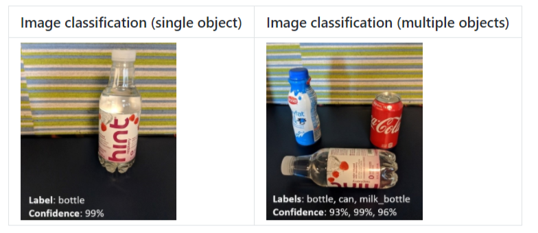
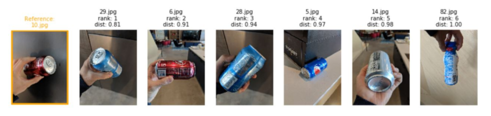
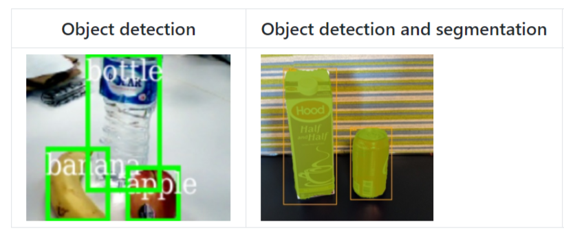
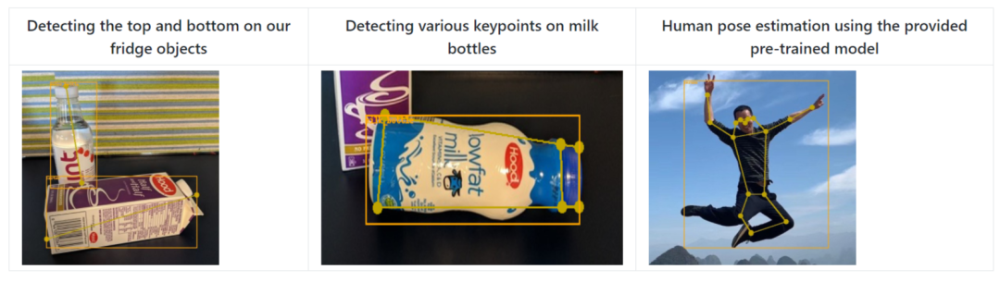
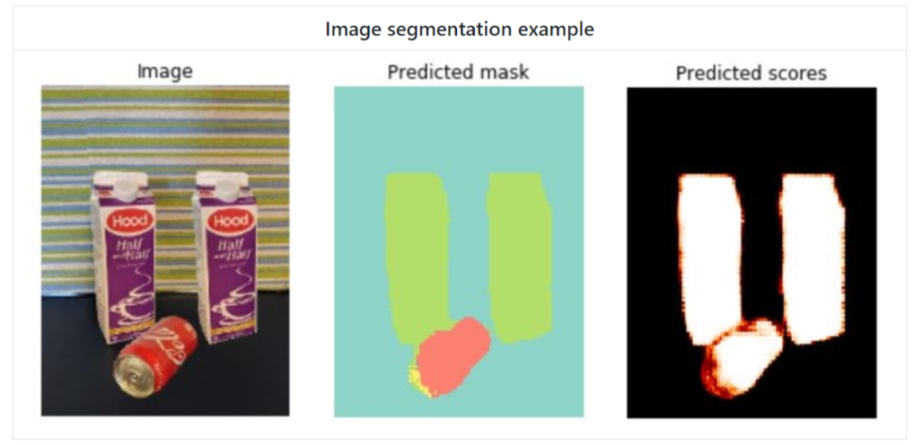
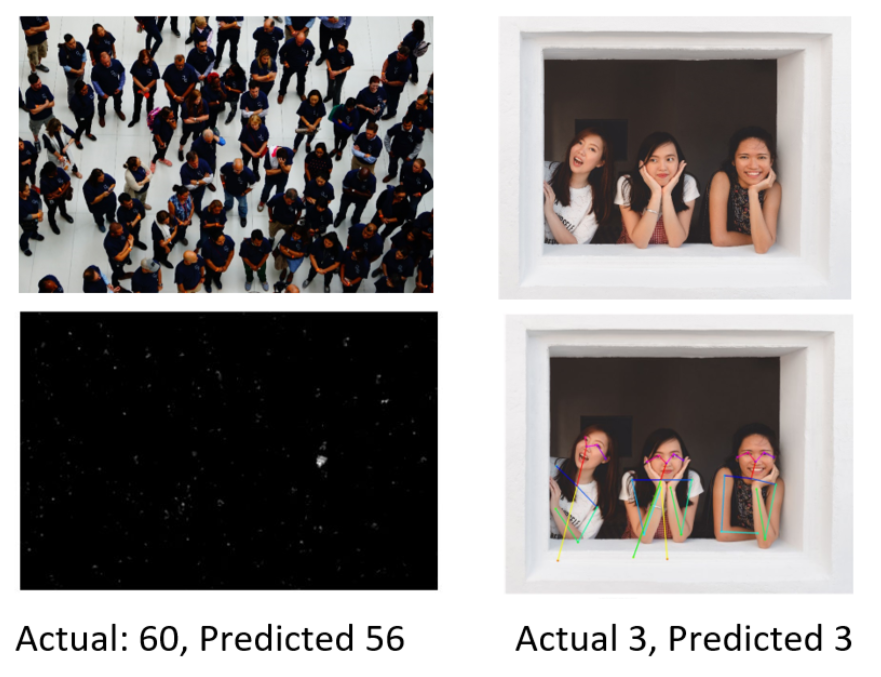

  

# computervision-recipes-
微软开源计算机视觉专题库，含分类、检测、分割、关键点、跟踪、动作识别等主流方向

微软在计算机视觉研究领域一直非常活跃，尤其是国内的微软亚洲研究院诞生了诸如残差网络（ResNet）、Faster RCNN、高分辨率网络（HRNet）等影响巨大的算法。

微软从去年开源了 computervision-recipes 库，并不断增加新的功能，含大量的 state-of-the-art 算法实现，最近该库1.2版本发布，新增多目标跟踪算法FairMOT和动作识别算法 R(2+1)D 。

目前该库已经覆盖的计算机视觉方向包括图像分类、图像相似度计算、目标检测、物体及人体关键点检测、图像分割、动作识别、目标跟踪、拥挤人群计数等计算机视觉热门方向。

computervision-recipes 库使用 PyTorch  Fast.ai 开发，提供了丰富的 Jupyter notebooks 手把手样例，方便学术研究和工程开发，即使是对计算机视觉了解甚少的人也可以很快上手。

### 1、图像分类，支持单目标和多目标分类：

### 2、图像相似度计算，在图像库中找到相似性高的物体，可用于图像检索：

BMVC 2019 论文 Classification is a Strong Baseline for Deep Metric Learning 效果

### 3、目标检测，支持Faster RCNN 和Mask RCNN算法：

Mask RCNN 检测结果

### 4、物体及人体关键点检测：

### 5、图像分割，UNet算法的分割结果：

### 6、动作识别，对视频中人物动作进行分类：

R(2+1)D算法效果

### 7、多目标跟踪：

FairMOT跟踪效果

### 8、拥挤人群计数：

该库样例丰富，使用简单，目前已经有超过4K星标，欢迎使用，也期待有更多实用CV算法加进来~

computervision-recipes：[开源地址](https://github.com/microsoft/computervision-recipes)

